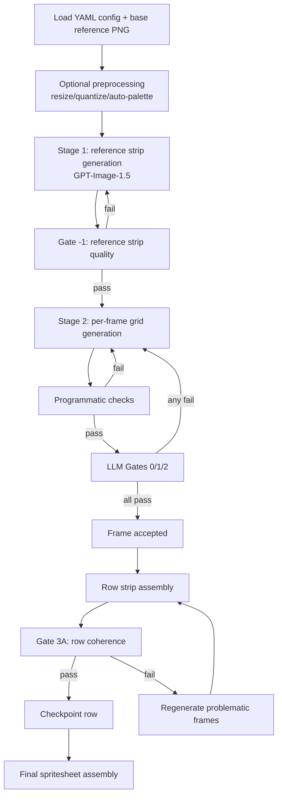

# SpriteForge Architecture: How Generation Works

This guide explains the runtime pipeline so contributors and advanced users can quickly navigate the codebase.

## Pipeline Overview



## Gate System

SpriteForge uses deterministic gate judgments (`temperature=0.0`) plus fast programmatic checks.

| Gate | Runs when | Checks | Pass behavior | Fail behavior |
|---|---|---|---|---|
| Programmatic checks | Every Stage 2 frame attempt | Grid size, symbols, outline, non-empty sprite, feet row positioning | Continue to LLM gates | Retry frame with escalation |
| Gate -1 | After each Stage 1 row strip generation | Whether rough strip is usable and matches expected animation intent/frame count | Continue to Stage 2 | Re-generate row strip (up to 3 attempts) |
| Gate 0 | Every Stage 2 frame attempt | Rendered pixel frame fidelity vs. Stage 1 reference frame | Frame can continue | Retry frame with escalation |
| Gate 1 | Non-anchor frames | Character identity consistency vs. anchor frame (Row 0 Frame 0) | Frame can continue | Retry frame with escalation |
| Gate 2 | Frames with a previous frame | Temporal continuity from previous frame | Frame can continue | Retry frame with escalation |
| Gate 3A | After row strip assembly | Whole-row animation coherence vs. Stage 1 reference strip | Row accepted/saved | Regenerate targeted frames and re-check row |

## Retry and Escalation Model

Frame generation uses 3 escalation tiers from `RetryManager`:

- **Soft (attempts 1-3, temp 1.0)**: minimal guidance, high creativity.
- **Guided (attempts 4-6, temp 0.7)**: include concrete gate feedback.
- **Constrained (attempts 7-10, temp 0.3)**: highly prescriptive guidance using accumulated failures.

Important defaults:

- Frame retries: up to 10 attempts (`RetryConfig.max_retries`).
- Stage 1 reference retries: up to 3 attempts per row.
- Gate 3A retries: controlled by `generation.gate_3a_max_retries` (default `2`).
- If Gate 3A feedback does not identify specific frames, fallback regenerates the last `generation.fallback_regen_frames` frames (default `2`).

## Anchor Frame and Identity Lock

`Row 0 / Frame 0` is the anchor frame:

1. Row 0 is always processed first.
2. Frame 0 from that row becomes the identity reference for the whole run.
3. All later rows receive anchor grid/rendered bytes in `FrameContext`.
4. Gate 1 enforces cross-row identity against this anchor.

This is the main mechanism keeping one character identity coherent across all animations.

### Anchor Cascade Recovery

When many non-anchor rows fail in the same pass, the workflow treats it as a likely identity-anchor drift and runs a targeted recovery cycle:

1. Evaluate failures using `AnchorRecoveryPolicy`.
2. If the failed-row ratio is at or above `generation.anchor_regen_failure_ratio` and retry budget remains (`generation.max_anchor_regenerations`), regenerate only row 0.
3. Clear non-anchor in-memory row outputs and retry non-anchor rows against the new anchor.

This keeps recovery policy/decision logic separate from row execution plumbing inside `SpriteForgeWorkflow.run()`.

## Concurrency Model

- **Anchor row first**: row 0 runs before any parallel work.
- **Non-anchor rows parallelized**: remaining rows run via `asyncio.gather`.
- **Optional concurrency cap**: `max_concurrent_rows` uses a semaphore when > 0.
- **Per-frame gate parallelism**: gates 0/1/2 are evaluated concurrently for a generated frame.

## Checkpoint and Resume Flow

When `--resume` / `checkpoint_dir` is enabled:

1. Workflow scans existing row checkpoints before generation.
2. Completed rows are loaded and skipped.
3. A row checkpoint is saved only after that row passes Gate 3A.
4. On successful final assembly, checkpoint files are cleaned up.

See also: [Checkpoint & Resume Example](checkpoint_resume_example.md)

## Module Dependency Map

```mermaid
flowchart LR
    CLI[cli.py] --> CFG[config.py]
    CLI --> WF[workflow.create_workflow]

    WF --> RP[row_processor.py]
    WF --> CK[checkpoint.py]
    WF --> ASM[assembler.py]

    RP --> FG[frame_generator.py]
    RP --> GT[gates.py]
    RP --> REF[providers.gpt_image]

    FG --> GEN[generator.py]
    FG --> GT
    FG --> RETRY[retry.py]

    GEN --> CHATGRID[providers.azure_chat\n(grid_model)]
    GT --> CHATGATE[providers.azure_chat\n(gate_model)]
    REF --> GPTIMG[gpt-image provider\n(reference_model)]
```

## Tiered Model Architecture

Model deployments are configured in YAML (`generation.*_model`) and wired in `create_workflow()`:

- `generation.reference_model` → Stage 1 reference strip provider.
- `generation.grid_model` → Stage 2 grid generation.
- `generation.gate_model` → all LLM verification gates.

By default, these map to:

- `gpt-image-1.5` (reference)
- `gpt-5.2` (grid generation)
- `gpt-5-mini` (gates)

### Credential Ownership Contract

`create_workflow()` now wires credential lifecycle using an explicit handle:

- If you pass `credential=...`, credential ownership remains with the caller (workflow does **not** close it).
- If you omit `credential`, the factory creates `DefaultAzureCredential` and marks it as workflow-owned.
- `SpriteForgeWorkflow.close()` (or `async with`) closes workflow-owned credentials plus provider resources.

This makes resource ownership visible at construction time and avoids implicit cleanup conventions.

## Where to Start as a Contributor

- Start with `src/spriteforge/workflow.py` for orchestration.
- Follow row-level flow in `src/spriteforge/row_processor.py`.
- Follow frame-level retries/gates in `src/spriteforge/frame_generator.py`.
- Check `src/spriteforge/retry.py` and `src/spriteforge/gates.py` before modifying gate behavior.
